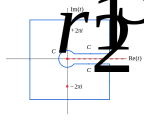
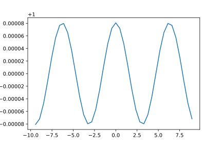
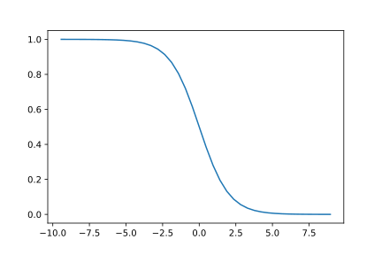

<article>

# Gamma function

## On more reflection

We are going to look more generally at the integral
$$\int \frac{t^{z-1}}{\exp(t)-1}dt$$

The contour is going to be along the lines of:

In this diagram we have only enclosed the poles closest to the origin. Eventually we are going to grow the square part of the contour to enclose more and more poles, show that the sum of residues plus the integral from the last section equal zero, and hence the integral will be the sum of the residues. It will also be seen that this sum is related to $\zeta$.

The integrals for $C_{1,2}$ are truncated versions of those from the last section, but carried out in the opposite sense, giving a minus sign. The $C_r$ integral is also in the opposite sense from that in the last section. It excludes the nasty (for non-integral $z$) branch cut along the real axis.

That leaves the square, $C_S$. We want to minimize its contribution and find values of $z$ for which it goes to zero at infinity. We want first $1/|\exp(t)-1|$ to be bounded along the path, and also $|t^{z-1}|$ to be small. The latter will occur if $\mathrm{Re}(z)$ is less than a certain value.

For the situation in the diagram we propose to go along the square enclosed by the pairs of lines $\mathrm{Re}(t)=\pm3\pi$ and $\mathrm{Im}(t)=\pm3\pi$. This encloses the two residues shown. The poles of $1/|\exp(t)-1|$ are at $\pm2\pi i$, giving residues for the $t^{z-1}$ factor of $(2\pi i)^{z-1}$ and $(-2\pi i)^{z-1}$, respectively:
$$\oint \frac{t^{z-1}}{\exp(t)-1}dt=2\pi i[(2\pi i)^{z-1}+(-2\pi i)^{z-1}
]$$

Since we want the integral (and sum) to go to zero at infinity $t$, we expect that $z$ will be limited to negative values.

We look at $|1/(\exp(t)-1)|$ at $\mathrm{Re}(t)=-3\pi$ with the imaginary part varying between $\pm3\pi$:

This oscillates around 1 since the exponential is close to zero. The behaviour for $\mathrm{Re}(t)=+3\pi$ is similar but oscillating near 0, since the exponential now dominates over 1. For larger values of $|\mathrm{Re}(t)|$, the oscillations near 1 and zero become even smaller, so on the vertical sides of the square, $|1/(\exp(t)-1)|$ is bounded.

The horizontal sides of the square, i.e. $\mathrm{Im}(t)=\pm3\pi$, give a smooth monotonic join from ~1 to ~0:

It is important for this that one passes between the poles, since if the path approached nearer them, one would see a blip.

Anyway the moral is that $|1/(\exp(t)-1)|$ is bounded around the square, and is actually less than 2, say. A rigorous argument would confirm this.

The length of the perimeter $8\times3\pi$. The $|t^{z-1}|$ factor is less than $(3\pi)^{\mathrm{Re}(z)-1}$, so long as $\mathrm{Re}(z)\lt1$. So the integral around $C_S$ is less than $2\times8\times3\pi(3\pi)^{\mathrm{Re}(z)-1}=16(3\pi)^{\mathrm{Re}(z)}$.

We propose to include more and more poles of $1/(\exp(t)-1)$ by expanding the square in steps of $2\pi$: $3\pi,5\pi,\dots,(2m+1)\pi,\dots$ The integral around the square is bounded by $16((2m+1)\pi)^{\mathrm{Re}(z)}$, which goes to zero as $m\rightarrow\infty$, if $\mathrm{Re}(z)<0$.

Now for the sum of residues:

$$\sum\limits_{m=0}^\infty2\pi i[((2m)\pi i)^{z-1}+(-(2m)\pi i)^{z-1}]$$

We can separate this into the product of two factors. The sum:
$$\sum\limits_{m=0}^\infty m^{z-1}=\zeta(1-z)$$
and:
$$2\pi i[(2\pi i)^{z-1}+(-2\pi i)^{z-1}]=(2\pi)^z[(i)^z-(-i)^z]$$
Replacing $i=\exp(i\pi/2)$ and $-i=\exp(3i\pi/2)$, the factor becomes $-(2\pi)^z2i\exp(i\pi z)\sin(\pi z/2)$.

From the last section:
$$\zeta(z)=\frac{\exp(-i\pi z)\Gamma(1-z)}{2\pi i}\int\limits_C \frac{t^{z-1}}{\exp(t)-1}dt$$
where $C=-C_1-C_r-C_2$. Equating to minus the residue sum:
$$\zeta(z)=\frac{\exp(-i\pi z)\Gamma(1-z)}{2\pi i}(2\pi)^z2i\exp(i\pi z)\sin(\pi z/2)\zeta(1-z) \\
=2^z(\pi)^{z-1}\sin(\pi z/2)\Gamma(1-z)\zeta(1-z)$$
The functional relation relates the value of $\zeta$ to its value reflected in the point $z=1/2$. The usual analytic continuation argument allows us to extend this to all, except for the singularities. One finds with a bit of thought that there is only one singularity, the pole at $z=1$.

The [Reflective interlude](6.html):

$$\Gamma(z)\Gamma(1-z)=\frac\pi{\sin(\pi z)}$$

and $\sin(\pi z)=2\sin(\pi z/2)\cos(\pi z/2)$ allows us to recast as:
$$\zeta(z)=\frac{(2\pi)^z}{2\cos(\pi z/2)\Gamma(z)}\zeta(1-z)$$

In particular:
$$\zeta(2m)=\frac{(2\pi)^{2m}}{2\cos(\pi m)\Gamma(2m)}\zeta(1-2m)$$

From the last section:
$$\zeta(-(2m+1))=-\frac{B_{2m+2}}{2m+2},m\ge0$$
or:
$$\zeta(1-2m)=\zeta(-(2(m-1)+1))=-\frac{B_{2m}}{2m}$$
giving:
$$\zeta(2m)=(-1)^{m+1}(2\pi)^{2m}\frac{B_{2m}}{2(2m)!}$$
</article>