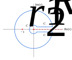

<article>

# Gamma function
## Reflective interlude

There is an important principle linking $\Gamma$ to its reflection in the point $z=1/2$. What this means is that $z-1/2\rightarrow-(z-1/2)$. Even more explicitly, $z'-1/2=-(z-1/2)$, which rearranged is $z'=1-z$. This is another way to extend the integral definition from $\mathrm{Re}(z)\gt0$ to $\mathrm{Re}(z)\lt1$. Note that there is an overlap strip.

The principle we are referring to gives a simple expression for the product $\Gamma(z)\Gamma(1-z)$. For the overlap strip $0\lt\mathrm{Re}(z)\lt1$, we obtain the double integral:
$$\int\limits_0^\infty\int\limits_0^\infty t^{z-1}s^{-z}\exp(-(t+s))dtds$$
Changing variables to $u=t+s$ and $v=t/s$, one finds $dtds/t=dudv/v(1+v)$, and hence:
$$\Gamma(z)\Gamma(1-z)=\int\limits_0^\infty\int\limits_0^\infty \frac{v^{z-1}}{1+v}\exp(-u)dudv$$
Since the $u$ integral is straightforward:
$$\int\limits_0^\infty\exp(-u)du=1$$
we are left with:
$$\Gamma(z)\Gamma(1-z)=\int\limits_0^\infty \frac{v^{z-1}}{1+v}dv$$
This is an improper integral, since the lower limit is singular for $0\lt z\lt1$. A well-known way to evaluate it is to use complex integration around a contour:

The integrand has a pole at $-1$, which is marked in the diagram with a red dot. Another feature of the integrand is that $v^{z-1}$ is not single valued in the complex plane. This is the source of the other red feature &mdash; a branch cut along the real axis, denoted by a red dashed line in the diagram. These are not bugs but features that will allow us to evaluate our improper integral.

Our contour contains just one pole, which means that the integration around the blue, arrowed contour is $2\pi i$, the residue at $v=-1$:
$$\oint \frac{v^{z-1}}{1+v}dv=2\pi i(-1)^{z-1}
$$
This is _not_ our integral. If we take the upper side of the branch cut as real, our integral is given by $C_1$ when $r\rightarrow0$ and $R\rightarrow\infty$. In the same limit, it is also related to the integral along $C_2$ by a complex factor.

This choice of values on the branch cut means that $-1=\exp(i\pi)$, and thus $2\pi i(-1)^{z-1}=2\pi i\exp(\pi(z-1)i)$.

We take the parts of the contour in turns.

Starting with our desired integral, as already mentioned:
$$\lim_{\begin{smallmatrix}r\rightarrow0 &\\ R\rightarrow\infty\end{smallmatrix}}\int_{C_1}\frac{v^{z-1}}{1+v}dv=\int\limits_0^\infty \frac{v^{z-1}}{1+v}dv$$

Moving on:
$$\lim_{R\rightarrow\infty}\left|\int_{C_R}\frac{v^{z-1}}{1+v}dv\right|\lt\lim_{R\rightarrow\infty}R^{z-2}2\pi R=0$$
We specified previously that $z\lt1$. The $R^{z-2}$ bit is an upper bound for the integrand, and $2\pi R$ is the circumference length of $C_R$.

Now the crux:
$$\lim_{\begin{smallmatrix}r\rightarrow0 &\\ R\rightarrow\infty\end{smallmatrix}}\int_{C_2}\frac{v^{z-1}}{1+v}dv=-\int\limits_0^\infty \frac{(v\exp(2\pi i))^{z-1}}{1+v}dv$$
The minus sign comes from the arrow direction on $C_2$. Although one could add the $\exp(2\pi i)$ to the other $v$ terms, only the part with a fractional power is truly affected. So $C_2$ gives our improper integral muliplied by $-\exp(2\pi(z-1)i)$.

And finally:
$$\lim_{r\rightarrow0}\left|\int_{C_r}\frac{v^{z-1}}{1+v}dv\right|\rightarrow\lim_{r\rightarrow0}r^{z-1}2\pi r=0$$
This time we use that in the overlap strip $z\gt0$ to get a zero limit.

Adding the non-zero bits and equating with the residue:

$$(1-\exp(2\pi(z-1)i))\int\limits_0^\infty \frac{v^{z-1}}{1+v}dv=2\pi i\exp(\pi(z-1)i)$$
Dividing through by $2i\exp(\pi(z-1)i)$:
$$-\sin(\pi(z-1))\int\limits_0^\infty \frac{v^{z-1}}{1+v}dv=\pi$$
Noting that $-\sin(\pi(z-1))=\sin(\pi z)$:
$$\Gamma(z)\Gamma(1-z)=\frac\pi{\sin(\pi z)}$$
This formula continues to the rest of the complex plane.

A simple application is to evaluate:
$$\Gamma(\tfrac12)^2=\frac{\pi}{\sin(\pi/2)}=\pi\implies\Gamma(\tfrac12)=\sqrt\pi$$.
This result can also be found by the traditional method of squaring a Gaussian:
$$\Gamma(\tfrac12)=\int\limits_0^\infty\frac{\exp(-t)}{\sqrt t}dt=2\int\limits_0^\infty\exp(-x^2)dx$$
Squaring the Gaussian:
$$\left[\int\limits_0^\infty\exp(-x^2)dx\right]^2= \\ \int\limits_0^\infty\int\limits_0^\infty\exp(-[x^2+y^2])dxdy= \\ \frac{\pi}2\int\limits_0^\infty\exp(-r^2)rdr=\frac{\pi}4$$
Combining the two gives the same result as the reflection calculation.
</article>