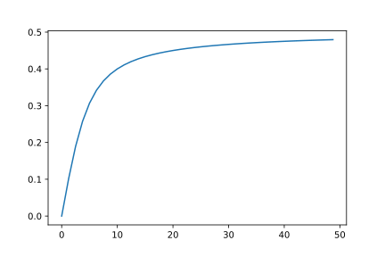

<article>

# Gamma function

## Binet 1

We now propose to integrate the digamma function $\psi$ to get $\ln\Gamma$:
$$\ln\Gamma(z)=\int\limits_1^z\psi(s)ds$$

We extract from before:

$$\psi(z)=\ln(z)-\frac1{2z}+ \\
\int\limits_0^\infty\left[\frac{1}t-\frac1 2-\frac{1}{\exp(t)-1}\right]\exp(-zt)dt$$

We note:
$$\int\limits_1^z\frac{ds}s=\left[\ln(s)\right]_1^z=\ln(z)$$
since $\ln(1)=0$. Next, integrating by parts:
$$\int\limits_1^z\ln(s)ds=\left[s\ln(s)\right]_1^z-\int\limits_1^z\frac{sds}s=z\ln(z)-z+1$$

Finally, the harder part:
$$\int\limits_1^z\int\limits_0^\infty\left[\frac{1}t-\frac1 2-\frac{1}{\exp(t)-1}\right]\exp(-st)dtds$$
The $s$ integral only affects the $\exp(-st)$ factor, for which we use:
$$\int\limits_1^z\exp(-st)ds=\left[\frac{\exp(-st)}{-t}\right]_1^z=\frac{\exp(-t)-\exp(-zt)}{t}$$
Thus the integral becomes:
$$\int\limits_0^\infty\left[\frac{1}t-\frac1 2-\frac{1}{\exp(t)-1}\right]\frac{\exp(-t)-\exp(-zt)}{t}dt$$
We define:
$$I(z)=\int\limits_0^\infty\left[\frac1 2-\frac1t+\frac{1}{\exp(t)-1}\right]\frac{\exp(-zt)}{t}dt$$
We have reversed the sign of the square bracket to make it positive. As $t\rightarrow0$, the square bracket varies as $B_2t/2=t/12$, where the Bernoulli number $B_2=1/6$. The function varies from 0 to 1/2 as $t\rightarrow\infty$:

Combining the bits:
$$\ln\Gamma(z)=z\ln(z)-z+1-\frac12\ln(z)+I(z)-I(1)$$
The completion will come with the evaluation of the constant term $1-I(1)$. .&nbsp;.&nbsp;.

</article>