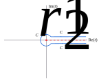

<article>

# Gamma function

## Riemann zeta connection

An interesting connection between the $\Gamma$ and the Riemann zeta function, $\zeta$, arises from:
$$\int\limits_0^\infty t^{z-1}\exp(-\alpha t)dt=\frac{\Gamma(z)}{\alpha^z}$$

If we combine this with:
$$\zeta(z)=\sum\limits_{n=1}^\infty \frac1{n^z}$$
we get:
$$\zeta(z)\Gamma(z)=\sum\limits_{n=1}^\infty \int\limits_0^\infty t^{z-1}\exp(-n t)dt \\
=\int\limits_0^\infty \frac{t^{z-1}}{\exp(t)-1}dt$$

This sketch using geometric summation needs some restrictions on $z$. The zeta function definition restricts this, for now, to $\mathrm{Re}(z)>1$. The $\Gamma$ definition is, of course, slightly more expansive.

We can use a contour to increase the range of definition:

This is similar to the contour we used in our Reflective interlude, except for the direction, and we have not included $C_R$, the big circle. Also the integration variable is $t$, not $v$.

Let us assume for now that $z$ is real and consider:
$$\int\limits_C \frac{t^{z-1}}{\exp(t)-1}dt$$
where $C=C_1+C_r+C_2$. We make the integral around the real axis tight enough to exclude the poles arising from zeros of the denominator at $2\pi ik, k\ne0,k\in\mathbb Z$.

The $C_1$ integral is $-\zeta(z)\Gamma(z)$, while that of $C_2$ is $\exp(2\pi(z-1))\zeta(z)\Gamma(z)$, assuming we can let $r\rightarrow0$. The integral around $C_r$ is less than $r^{z-2}2\pi r$. This goes to zero as $r\rightarrow0$ so long as $z>1$. So in this region:
$$\int\limits_C \frac{t^{z-1}}{\exp(t)-1}dt=2i\exp(i\pi z)\sin(\pi z)\zeta(z)\Gamma(z)$$

Using the Reflective interlude:
$$\zeta(z)=\frac{\exp(-i\pi z)\Gamma(1-z)}{2\pi i}\int\limits_C \frac{t^{z-1}}{\exp(t)-1}dt$$
This well defined for all $z$, except at the poles of $\Gamma$. These are at $1-z\le0,1-z\in \mathbb Z$. But the $\zeta$ is well defined for $\mathrm{Re}(z)>1$, so the only possible singularity must be at $z=1$. [The apparent poles for $z=2,3,\dots$ must be cancelled by zeros of the contour integral.]

In fact the contour integral at $z=1$ has no branch cut ($C_1$ and $C_2$ cancel against each other), so one is just left with $C_r$:
$$\int\limits_{C_r} \frac{t^{1-1}}{\exp(t)-1}dt\rightarrow\int\limits_{C_r} \frac{dt}t=2\pi i$$
At the same time, $\Gamma(1-z)\rightarrow1/(1-z)$, so the singularity is a simple pole with $-1$ Cauchy residue. This means that $\zeta(z)\rightarrow-1/(1-z)$, which has residue $+1$.

We can evaluate $\zeta$ at non-positive integers using, again, Cauchy residue calculus. The Bernoulli numbers are defined:
$$\frac t{\exp(t)-1}=\sum\limits_{n=0}^\infty \frac{B_n}{n!}t^n$$
For non-positive $k\in\mathbb Z$:
$$\int\limits_{C_r} \frac{t^{k-1}}{\exp(t)-1}dt\rightarrow\int\limits_{C_r} t^{k-2}\sum\limits_{n=0}^\infty \frac{B_n}{n!}t^ndt$$
The integral residue comes from the term $1/t$, i.e. only if $k-2+n=-1$ or $k=1-n$, giving $2\pi iB_n/n!$. Hence:
$$\zeta(1-n)=(-1)^{n-1}\Gamma(n)\frac{B_n}{n!}=(-1)^{n-1}\frac{B_n}n$$
since $\Gamma(n)=(n-1)!$. The $n=0$ case is infinite, as expected from $\zeta(1)$ being a pole. We can evaluate the analytic continuation $\zeta(0)=B_1=-1/2$. For $m\gt0$,
$$\zeta(-2m)=(-1)^{2m}\frac{B_{2m+1}}{2m+1}=0$$
from a well-known property of Bernoulli numbers. By contrast
$$\zeta(-(2m+1))=-\frac{B_{2m+2}}{2m+2},m\ge0$$
is non-zero.
</article>