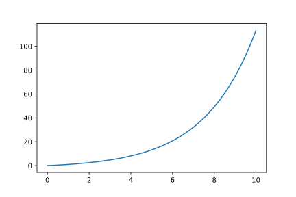

<article>

# Deformed algebras

## Na&iuml;ve q-deformed oscillator

There are various routes to q/Q-deformations. Although these are often referred to as “quantum-deformations”, this seems to be partly a muddling of the history. These deformations were originally studied in classical number theory and so on. I have the impression that once the ideas were applied to quantum-like systems, and the fact that the letter “q” or its uppercase version were used as the parameter, which also is the first letter of “quantum”, and voilà.

Here we will start from a deformation of the boson commutator: $[a,a^\dagger]_q=aa^\dagger-qa^\dagger a=1$. In terms of the function $\Phi$, one gets a recurrence relation: $\Phi(N+1)-q\Phi(N)=1$. If we assume $\Phi(0)=0$, so the states are bounded from below, the recurrence leads to a sum for the states:
$$\Phi(n)=\sum\limits_{k=0}^{n-1}q^k=\frac{q^n-1}{q-1},$$
since this is our old friend, the geometric sum.

<caption>$q=1/2$</caption>

It may be of interest to consider negative $q$ (difficult to graph for non-integer $n$ as values of $q^n$ become complex).

<table id="T_4fd0d_">
  <caption>$\Phi$</caption>
  <thead>
    <tr>
      <th class="index_name level0" >n\q</th>
      <th class="col_heading level0 col0" >-1.5</th>
      <th class="col_heading level0 col1" >-1.0</th>
      <th class="col_heading level0 col2" >-0.5</th>
      <th class="col_heading level0 col3" >0.0</th>
      <th class="col_heading level0 col4" >0.5</th>
      <th class="col_heading level0 col5" >1.0</th>
      <th class="col_heading level0 col6" >1.5</th>
    </tr>
  </thead>
  <tbody>
    <tr>
      <th id="T_4fd0d_level0_row0" class="row_heading level0 row0" >0</th>
      <td id="T_4fd0d_row0_col0" class="data row0 col0" >-0.000000</td>
      <td id="T_4fd0d_row0_col1" class="data row0 col1" >-0.000000</td>
      <td id="T_4fd0d_row0_col2" class="data row0 col2" >-0.000000</td>
      <td id="T_4fd0d_row0_col3" class="data row0 col3" >-0.000000</td>
      <td id="T_4fd0d_row0_col4" class="data row0 col4" >-0.000000</td>
      <td id="T_4fd0d_row0_col5" class="data row0 col5" >0</td>
      <td id="T_4fd0d_row0_col6" class="data row0 col6" >0.000000</td>
    </tr>
    <tr>
      <th id="T_4fd0d_level0_row1" class="row_heading level0 row1" >1</th>
      <td id="T_4fd0d_row1_col0" class="data row1 col0" >1.000000</td>
      <td id="T_4fd0d_row1_col1" class="data row1 col1" >1.000000</td>
      <td id="T_4fd0d_row1_col2" class="data row1 col2" >1.000000</td>
      <td id="T_4fd0d_row1_col3" class="data row1 col3" >1.000000</td>
      <td id="T_4fd0d_row1_col4" class="data row1 col4" >1.000000</td>
      <td id="T_4fd0d_row1_col5" class="data row1 col5" >1</td>
      <td id="T_4fd0d_row1_col6" class="data row1 col6" >1.000000</td>
    </tr>
    <tr>
      <th id="T_4fd0d_level0_row2" class="row_heading level0 row2" >2</th>
      <td id="T_4fd0d_row2_col0" class="data row2 col0" >-0.500000</td>
      <td id="T_4fd0d_row2_col1" class="data row2 col1" >-0.000000</td>
      <td id="T_4fd0d_row2_col2" class="data row2 col2" >0.500000</td>
      <td id="T_4fd0d_row2_col3" class="data row2 col3" >1.000000</td>
      <td id="T_4fd0d_row2_col4" class="data row2 col4" >1.500000</td>
      <td id="T_4fd0d_row2_col5" class="data row2 col5" >2</td>
      <td id="T_4fd0d_row2_col6" class="data row2 col6" >2.500000</td>
    </tr>
    <tr>
      <th id="T_4fd0d_level0_row3" class="row_heading level0 row3" >3</th>
      <td id="T_4fd0d_row3_col0" class="data row3 col0" >1.750000</td>
      <td id="T_4fd0d_row3_col1" class="data row3 col1" >1.000000</td>
      <td id="T_4fd0d_row3_col2" class="data row3 col2" >0.750000</td>
      <td id="T_4fd0d_row3_col3" class="data row3 col3" >1.000000</td>
      <td id="T_4fd0d_row3_col4" class="data row3 col4" >1.750000</td>
      <td id="T_4fd0d_row3_col5" class="data row3 col5" >3</td>
      <td id="T_4fd0d_row3_col6" class="data row3 col6" >4.750000</td>
    </tr>
    <tr>
      <th id="T_4fd0d_level0_row4" class="row_heading level0 row4" >4</th>
      <td id="T_4fd0d_row4_col0" class="data row4 col0" >-1.625000</td>
      <td id="T_4fd0d_row4_col1" class="data row4 col1" >-0.000000</td>
      <td id="T_4fd0d_row4_col2" class="data row4 col2" >0.625000</td>
      <td id="T_4fd0d_row4_col3" class="data row4 col3" >1.000000</td>
      <td id="T_4fd0d_row4_col4" class="data row4 col4" >1.875000</td>
      <td id="T_4fd0d_row4_col5" class="data row4 col5" >4</td>
      <td id="T_4fd0d_row4_col6" class="data row4 col6" >8.125000</td>
    </tr>
    <tr>
      <th id="T_4fd0d_level0_row5" class="row_heading level0 row5" >5</th>
      <td id="T_4fd0d_row5_col0" class="data row5 col0" >3.437500</td>
      <td id="T_4fd0d_row5_col1" class="data row5 col1" >1.000000</td>
      <td id="T_4fd0d_row5_col2" class="data row5 col2" >0.687500</td>
      <td id="T_4fd0d_row5_col3" class="data row5 col3" >1.000000</td>
      <td id="T_4fd0d_row5_col4" class="data row5 col4" >1.937500</td>
      <td id="T_4fd0d_row5_col5" class="data row5 col5" >5</td>
      <td id="T_4fd0d_row5_col6" class="data row5 col6" >13.187500</td>
    </tr>
    <tr>
      <th id="T_4fd0d_level0_row6" class="row_heading level0 row6" >6</th>
      <td id="T_4fd0d_row6_col0" class="data row6 col0" >-4.156250</td>
      <td id="T_4fd0d_row6_col1" class="data row6 col1" >-0.000000</td>
      <td id="T_4fd0d_row6_col2" class="data row6 col2" >0.656250</td>
      <td id="T_4fd0d_row6_col3" class="data row6 col3" >1.000000</td>
      <td id="T_4fd0d_row6_col4" class="data row6 col4" >1.968750</td>
      <td id="T_4fd0d_row6_col5" class="data row6 col5" >6</td>
      <td id="T_4fd0d_row6_col6" class="data row6 col6" >20.781250</td>
    </tr>
    <tr>
      <th id="T_4fd0d_level0_row7" class="row_heading level0 row7" >7</th>
      <td id="T_4fd0d_row7_col0" class="data row7 col0" >7.234375</td>
      <td id="T_4fd0d_row7_col1" class="data row7 col1" >1.000000</td>
      <td id="T_4fd0d_row7_col2" class="data row7 col2" >0.671875</td>
      <td id="T_4fd0d_row7_col3" class="data row7 col3" >1.000000</td>
      <td id="T_4fd0d_row7_col4" class="data row7 col4" >1.984375</td>
      <td id="T_4fd0d_row7_col5" class="data row7 col5" >7</td>
      <td id="T_4fd0d_row7_col6" class="data row7 col6" >32.171875</td>
    </tr>
    <tr>
      <th id="T_4fd0d_level0_row8" class="row_heading level0 row8" >8</th>
      <td id="T_4fd0d_row8_col0" class="data row8 col0" >-9.851562</td>
      <td id="T_4fd0d_row8_col1" class="data row8 col1" >-0.000000</td>
      <td id="T_4fd0d_row8_col2" class="data row8 col2" >0.664062</td>
      <td id="T_4fd0d_row8_col3" class="data row8 col3" >1.000000</td>
      <td id="T_4fd0d_row8_col4" class="data row8 col4" >1.992188</td>
      <td id="T_4fd0d_row8_col5" class="data row8 col5" >8</td>
      <td id="T_4fd0d_row8_col6" class="data row8 col6" >49.257812</td>
    </tr>
    <tr>
      <th id="T_4fd0d_level0_row9" class="row_heading level0 row9" >9</th>
      <td id="T_4fd0d_row9_col0" class="data row9 col0" >15.777344</td>
      <td id="T_4fd0d_row9_col1" class="data row9 col1" >1.000000</td>
      <td id="T_4fd0d_row9_col2" class="data row9 col2" >0.667969</td>
      <td id="T_4fd0d_row9_col3" class="data row9 col3" >1.000000</td>
      <td id="T_4fd0d_row9_col4" class="data row9 col4" >1.996094</td>
      <td id="T_4fd0d_row9_col5" class="data row9 col5" >9</td>
      <td id="T_4fd0d_row9_col6" class="data row9 col6" >74.886719</td>
    </tr>
    <tr>
      <th id="T_4fd0d_level0_row10" class="row_heading level0 row10" >10</th>
      <td id="T_4fd0d_row10_col0" class="data row10 col0" >-22.666016</td>
      <td id="T_4fd0d_row10_col1" class="data row10 col1" >-0.000000</td>
      <td id="T_4fd0d_row10_col2" class="data row10 col2" >0.666016</td>
      <td id="T_4fd0d_row10_col3" class="data row10 col3" >1.000000</td>
      <td id="T_4fd0d_row10_col4" class="data row10 col4" >1.998047</td>
      <td id="T_4fd0d_row10_col5" class="data row10 col5" >10</td>
      <td id="T_4fd0d_row10_col6" class="data row10 col6" >113.330078</td>
    </tr>
  </tbody>
</table>

We sweep through $q$ values in the range $[-1.5,1.5]$. For $q\ge1$ the $\Phi$ values increase without limit. For q in the open range $(-1,1)$ $\Phi$ has values between 0 and a bound of $1/(1-q)$. For positive $q$ the $\Phi$ values increase steadily to this limit. For $q\lt0$ the progress is not monotonic. For $q\lt-1$ the value of $\Phi$ is _not_ bounded above or below. And the negative values are “unphysical”, since they represent the value of $a^\dagger a$ on $|n\rangle$, which must be positive for the Born probability interpretation, as explained earlier. For $q=-1$ we have another old friend, the Fermi-Dirac anticommutator. The Bose-Einstein commutator is, of course, $q=1$.
</article>