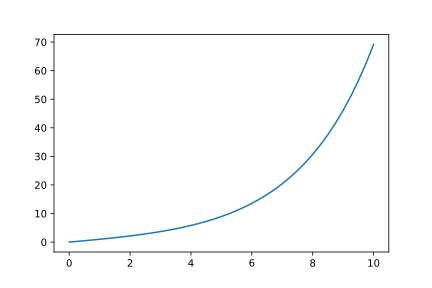
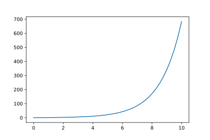
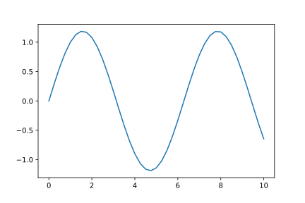
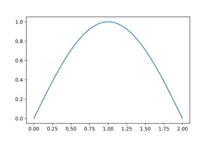
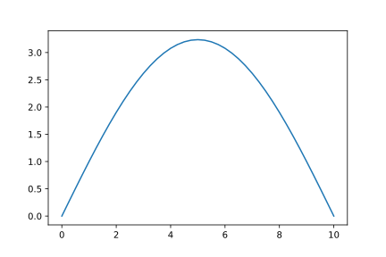

<article>

# Deformation

## Standard q-deformation

An alternative, more standard approach enables $q$ to start exploring some complex values. This maintains the $q$-commutator, but alters its value dependent on $N$: $[a,a^\dagger]_q=aa^\dagger-qa^\dagger a=q^{-N}$. This devolves to the ordinary Einstein-Boson form when $q=1$. It almost gives the Fermi-Dirac form at $q=-1$ &mdash; but there are some further considerations needed in this case, which we won't go into in detail.

We now need to evaluate $\Phi$. The recurrence is $\Phi(n+1)=q\Phi(n)+q^{-n}$, starting from $\Phi(0)=0$. If we define $\Phi(n)=f(n)/q^{n-1}$, we find the recurrence relation $f(n+1)=q^2f(n)+1$ or, using the previous (na&iuml;ve) work, $f(n)=(q^{2n}-1)/(q^2-1)$. Hence, $\Phi(n)=f(n)/q^{n-1}=(q^n-q^{-n})/(q-q^{-1})$.

We notice a reciprocal symmetry in $q$: $\Phi_q(n)=\Phi_{1/q}(n).$ Therefore, $q=1.5=3/2$ gives the same curve as $q=2/3$. Similarly, the $q=0.5=1/2$ curve is the same as $\Phi_2$. With $q=\exp(\tau)$, one can rewrite: $\Phi_\tau(n)=\sinh(\tau n)/\sinh(\tau)$. The $q\leftrightarrow1/q$ becomes $\tau\leftrightarrow-\tau$; $\Phi_\tau$ is even in $\tau$.

The function $\Phi$ is also real if $q\bar{q}=1$. This allows complex $q=\exp(i\theta)$ of modulus 1. One finds $\Phi_\theta(n)=\sin(n\theta)/\sin(\theta)$.

The state progression terminates only if $\Phi(m)=0$ for some integer $m$. This occurs for $\theta=\pi/m$. For other values of $\theta$, there will be negative values of $\Phi$ before the sequence terminates. For irrational $\theta/\pi$, the state progression will not terminate.

This is the Fermi-Dirac $\Phi$.

A final question: are there any other values of $q$ that give a real $\Phi$? Again $\Phi_q(2)=(q^2-1/q^2)/(q-1/q)=q+1/q$. For this to be a real number $a$, we need $q^2-aq+1=0$. The quadratic has solution $q=a/2\pm\sqrt{a^2/4-1}$. The is real for $|a|\ge2$, but complex for $|a|\lt2$. In the latter case, one finds $q\bar q=1$, so we have all the cases leading to real $\Phi$.

</article>