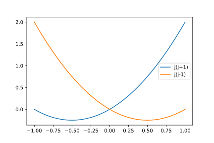
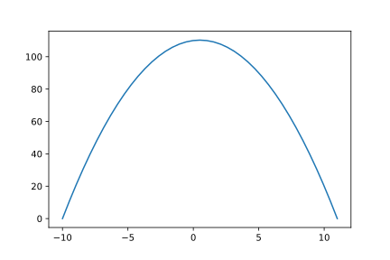
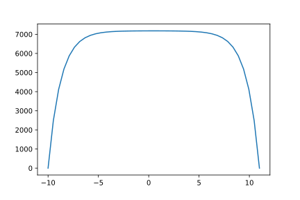
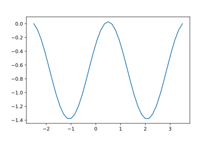

<article>

# Deformation

## su(2)-deformation

Here we look at commutators $[J_0,J_\pm]=\pm J_\pm$, in other words angular momentum/spin (3 dimensions) or the Lie algebra for the special unitary group in 2 dimensions, su(2). In the standard theory, one adds the commutator $[J_+,J_-]=2J_0$. For deformation, we want to restrict to an finite integer-spaced series of $J_0$ eigenstates, symmetric about 0, as in the standard theory. We also want mutual adjointness: $J_+^\dagger=J_-,J_-^\dagger=J_+$. We also define $J_+J_-=\Psi(J_0)$, since this combination commutes with $J_0$. Also $J_-J_+=\Psi(J_0+1)$, as before.

We assume, as for standard su(2), that there is a state $|J\rangle$ for which $J_+|J\rangle=0$. We have a series of integer-separated states $|M\rangle\propto J_-^{J-M}|J\rangle$. Normally the su(2) structure leads to $J_-|-J\rangle=0$, so that the states are integer spaced and symmetrically placed about zero, leading to the half-integer condition on $J$.

Using $\Psi$ on these extreme states, $\Psi(J+1)=0$ and $\Psi(-J)=0$. We would like to define a new function that gives $\Psi$ a variable that increases the number of states as it increases. On the basis of the literature we suggest $\Psi(J_0)=C-\Phi(J_0(J_0-1))$. The condition $\Psi(J+1)=0$ gives $C=\Phi(J(J+1))$. Also, $\Psi(-J)=0$ gives $C=\Phi(-J(-J-1))=\Phi(J(J+1))$. Phew! It would have been a real pain if they had not been the same.

In fact the operator $C=J_+J_-+\Phi(J_0(J_0-1))=J_-J_++\Phi(J_0(J_0+1))$ serves as an analogue to the $J^2$ Casimir operator of undeformed su(2). It commutes with all the operators $J_0,J_+,J_-$. We now have $\Psi(J_0)=\Phi(J(J+1))-\Phi(J_0(J_0-1))$. We note that $J(J\pm1)\ge-1/4$ with the minimums occurring according to sign at $J=\mp1/2$. Otherwise the value is positive for half-integral $J$.

If we take $\Phi_q(J_0(J_0-1))$ as $[J_0]_q[J_0-1]_q$, where $[n]_q=(q^n-1/q^n)/(q-1/q)=\sinh(\tau n)/\sinh(\tau)=\sin(\theta n)/\sin(\theta)$, depending on whether $q$ is real or complex, one derives $[J_+,J_-]=[2J_0]_q$.

Moving on to complex $q$, we find the standard form is $\theta=0$. For non-zero $\theta$ we find oscillations:

This leads to “non-physical” negative (square) norm states. Either the $J_+,J_-$ operators are _not_ mutual adjoints, or the Hilbert space (squared) norm is not positive definite.

### Some concluding remarks

I am stopping this work for the time being, until I come across a compelling application of these ideas that doesn't seem as artificial as what I've covered. I hear tell of use in deriving Yang-Baxter type results that are of use in exact solutions of statistical mechanics problems (e.g. 2-dimensional Ising model). There may be applications where the negative (square) norm states may be used, e.g. special/general relativity. In quantum contexts, one usually needs to avoid these “ghost” states. For example, much effort needs to be applied in gauge theory, where the na&iuml;ve theory tends to produce ghosts. These ghosts cancel out some of the positive norm states (e.g. longitudinal “photons”, leaving transverse states).

</article>