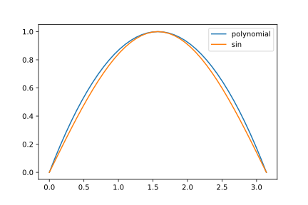
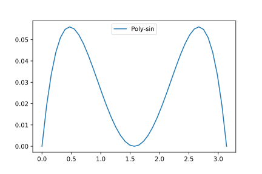
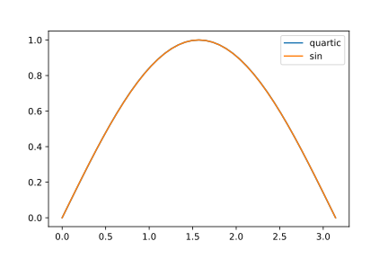
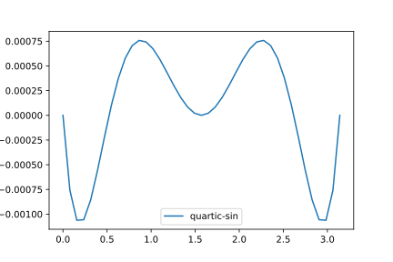

<article>

# Interpolation

## Lagrange polynomials

 Let us imagine that we want to approximate a function for which we know a few values for intermediate points, say $\sin x$ between 0 and $\pi$.

 We know $\sin x$ for a number of significant values. From the off, we know $\sin0=\sin\pi=0$, and $\sin (\pi/2)=1$.

The simplest polynomial that satisfies these three constraints is $4x(1-x/\pi)/\pi$. We can draw a graph:

If we plot the difference:

We note that the biggest differences come around $x=0.5,2.5$. You may remember from early trigonometry that $\sin30\degree=1/2$ (this can be derived from half an equilateral triangle). Of course, for general function theory, radians are a better measure of angles so we need to multiply the degree values by $2\pi/360)$, to give $\sin(\pi/6)=1/2$. Standard arguments lead us to believe also $\sin(5\pi/6)=1/2$ too.

The lowest order polynomial that can fit five general points is a quartic, i.e. the highest power of $x$ is four. One can do a brute force method writing out the various equations the polynomial coefficients need to statisfy and solving the (linear) equations. One finds the use of Vandermonde matrices, determinants, and inverses simplifies this a bit. I have some python code to do this. I would publish, after some tidying up, if anyone was interested.

Lagrange hit on a simpler route. Notice that our previous solution was 1 at $\pi/2$ and 0 at $0,\pi$. Lagrange polynomials generalise this behaviour.

Given a set of (distinct) values where our function is defined, $\{x_i\}$, we define:

$$l_i(x)=\frac{\prod\limits_{j\ne i} (x-x_j)}{\prod\limits_{j\ne i} (x_i-x_j)}$$

The thing to notice is that $l_i(x_j)=0$ so long as $i\ne j$. But there is more: $l_i(x_i)=1$.

Using this we can construct an interpolation:

$$Lf(x)=\sum\limits_i f(x_i)l_i(x)$$

If there are $N$ fixed coordinates, $\{(x_i,f(x_i))\}$, the polynomial has degree $N-1$. Imagine we have another polynomial going through these points. Take the difference. We then have an $N-1$ order polynomial with $N$ zeros. The only such polynomial is the zero polynomial. [E.g. a non-zero quartic polynomial can have at most four zeros.]

In our case, adding in the $\pi/6,5\pi/6$ points, we end up with the graph:

The quartic curve is hiding behind the “real” function (i.e. the values given by the maths processing unit/modules, which in their turn use better interpolations or approximations).

We disentangle by taking the difference again:

The accuracy has been increased from two decimals to three. We could improve by adding further points.

 </article>